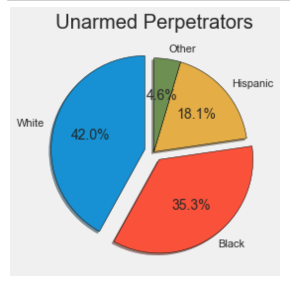
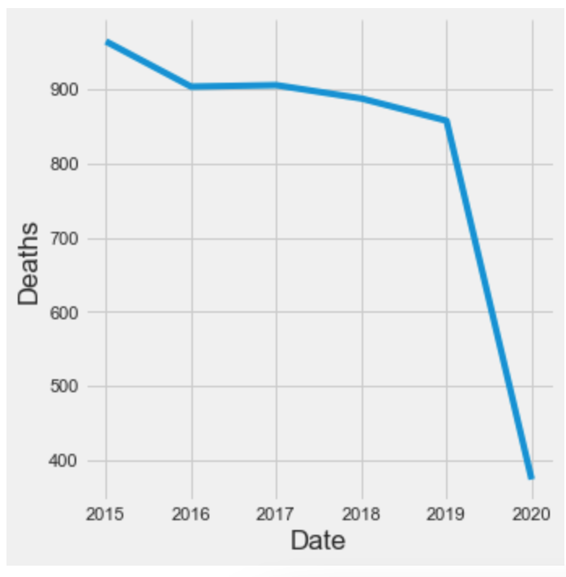

# US-Police Shootings

The murder of [George Floyd](https://en.wikipedia.org/wiki/Murder_of_George_Floyd) at the hands of a **White PoliceMan** sent a shockwave throughout the US. It lead to a country wide protests and almost created anarchic situations in some of the states. 

According to some, this murder was not an anamoly. The US Police-Men have time and again been accused of racism and there are far too many cases where unarmed black men were unjustly killed by the police. Here, we try to analyze if this accusation is true.

Let the [data](https://www.kaggle.com/ahsen1330/us-police-shootings) speak!!

## Insights from the data

### Contrary to popular belief, more unarmed white men compared to black men are shot every year. 

 

### The data shows that the number of deaths due to shootings have gradually decreased over the years.



### Number of people shot to death by the police in the United States from 2015 to 2020 by race.


It is also important to note that ```22.53%``` of people shot were mentally ill.

## Conclusion
The data does show that the police have shot and killed significant number of unarmed men. Although the number of casualties are decreasing, nonetheless less the problem is there.

## Project By
Roman Regmi