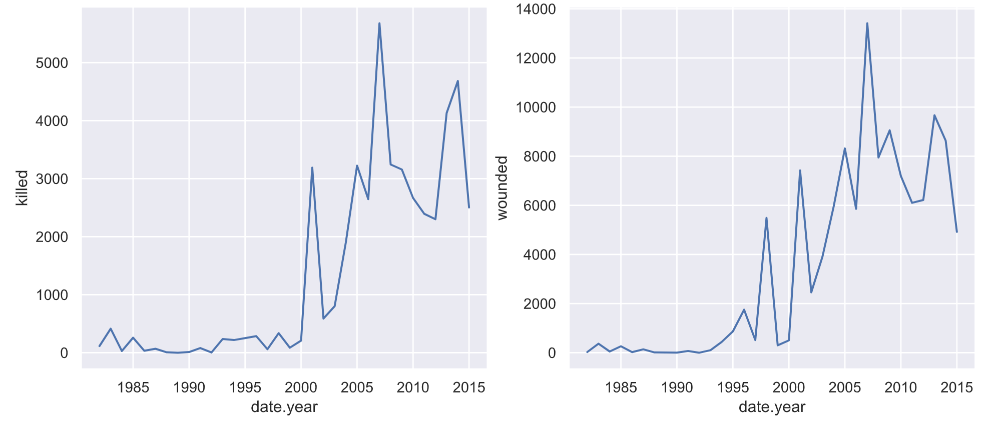
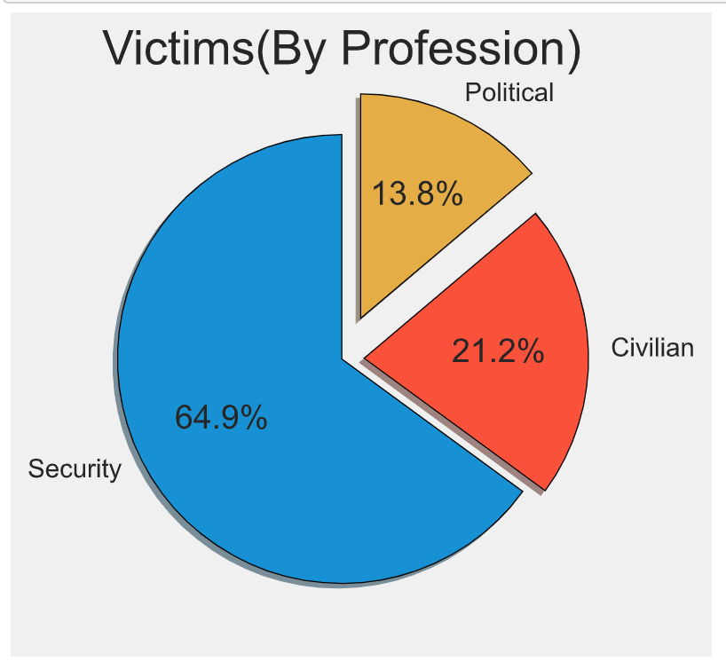
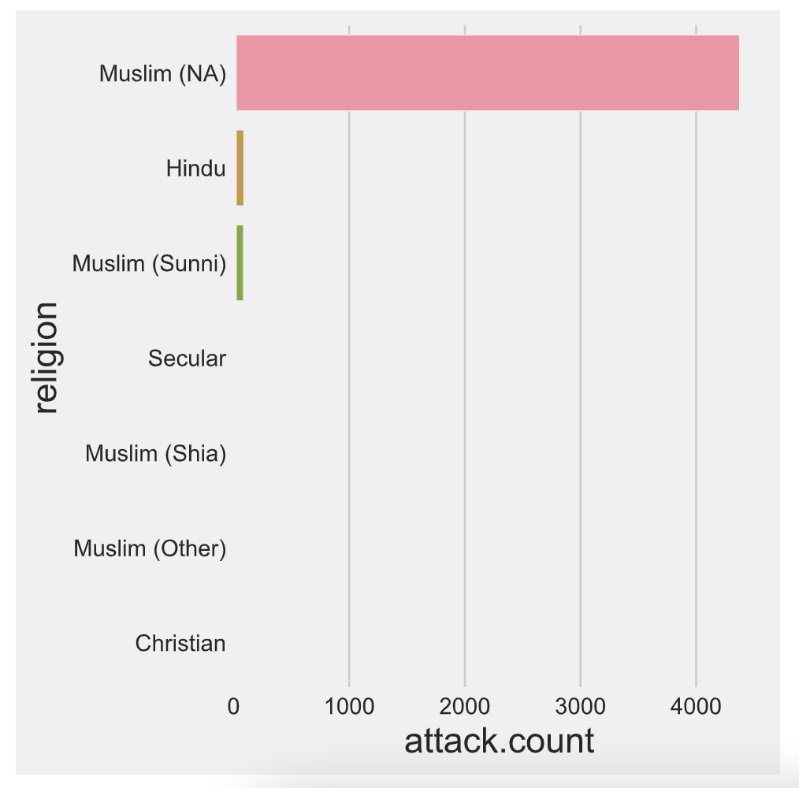

# Suicide Attacks

Suicide bombing is an operational method in which the very act of the attack is dependent upon the death of the perpetrator. Though only 3% of all terrorist attacks around the world can be classified as suicide bombing attacks these account for 48% of the casualties. Explosions and suicide bombings have become the modus operandi of terrorist organizations throughout the world. 

In this project, we try to analyze the suicide attacks that took place in between 1985-2015.

## Insights from the data

The following line chart shows that suicide attacks & casualties resulting from it grew in between 2002-2007 and in between 2012-2014. This former could be because of the [civil war](https://en.wikipedia.org/wiki/Sri_Lankan_Civil_War) that took place in SriLanka, and the later could be because of the rise of [ISIS](https://en.wikipedia.org/wiki/Islamic_State) in the Middle East.  

 

The data also showed that majority of the victim of suicide attacks were Military Personnel followed by Cilivlians and finally by Politicians. 

 

Since the motivation behind such attacks can be religious, political or both, it would be interesting to see which religious group was mostly involved in suicide attacks.

 

## Project By
Roman Regmi
